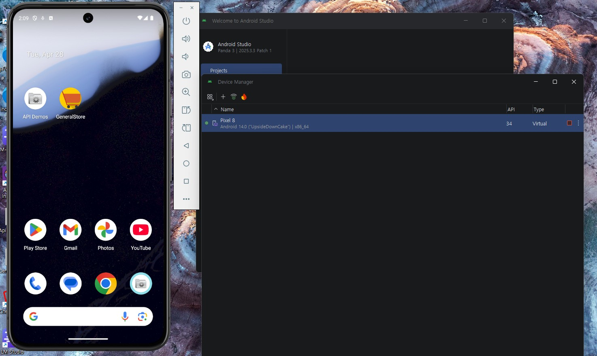
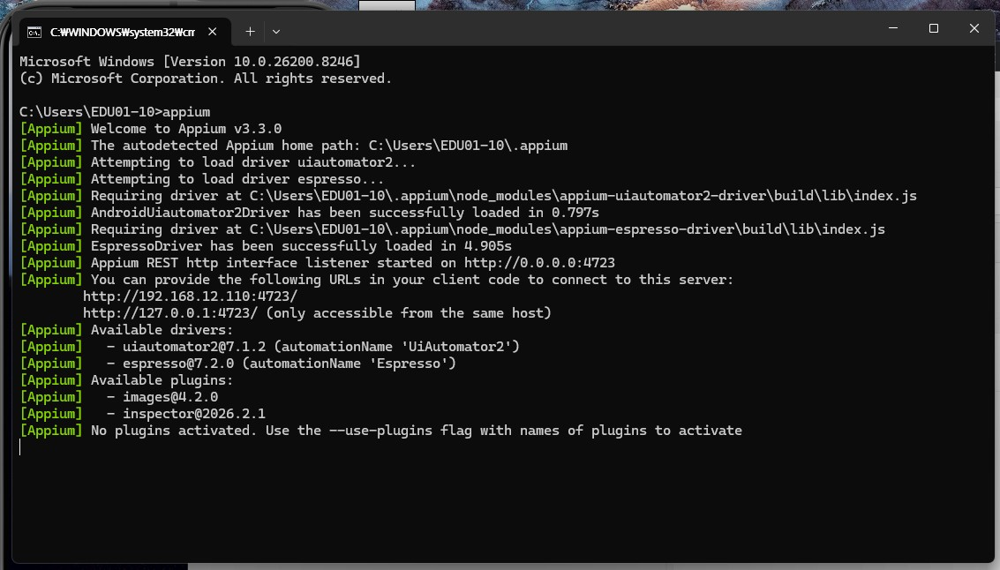
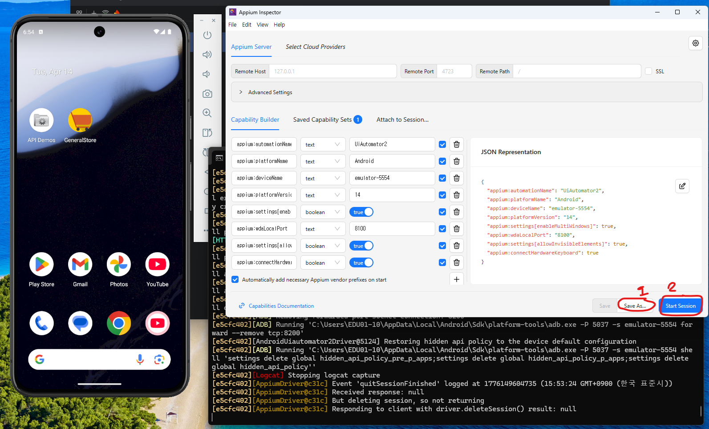
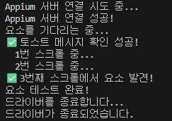
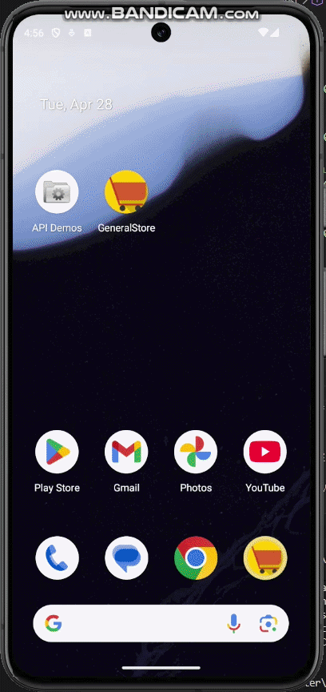
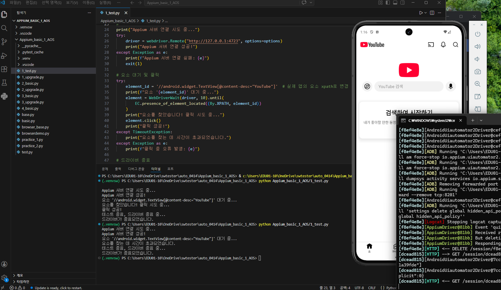
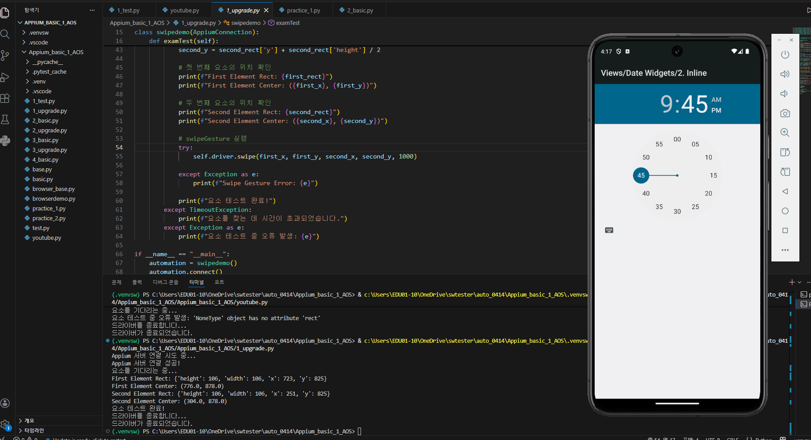

### appium 활용한 쇼핑몰앱 테스트

# 실행 시나리오
1. 쇼핑몰 앱 실행
2. 국가를 “Angola”로 선택
3. “Your name”은 빈칸으로 둠
4. “Female”선택
5. “Let’s Shop” 버튼 클릭
6. 잘못된 입력시 토스트(Toast)오류 메세지가 적절히 표시되는지 확인 → assert 기능 확인해볼 수 있는 곳
7. “Your name”에 “kim”입력
8. 앱에서 스크롤해 “Air Jordan 9 Retro” 상품을 장바구니에 담기
9. 장바구니 클릭
10. “Air Jordan 9 Retro”  상품이 있는지 확인
11. 하단의 “Please read our team of conditions”를 클릭
12. 체크박스 클릭
13. “Visit to the website to completes purchase”버튼 클릭
14. 브라우저로 이동하는지 확인 후 백 버튼 클릭
15. 첫 화면으로 이동했는지 확인

# 시작 전 appium셋팅






# 실행 코드

```python
import time

from appium import webdriver
from appium.options.android import UiAutomator2Options
from appium.webdriver.common.appiumby import AppiumBy
from selenium.webdriver.common.by import By
from selenium.webdriver.support.ui import WebDriverWait
from selenium.webdriver.support import expected_conditions as EC
from selenium.common.exceptions import TimeoutException
from selenium.webdriver.common.keys import Keys
from selenium.common.exceptions import NoSuchElementException

# AppiumConnection 클래스가 정의된 파일을 가져오기
from base import AppiumConnection  

options = UiAutomator2Options()

# 스크롤해서 “Air Jordan 9 Retro” 상품 찾기
def scroll_and_find(driver, xpath, max_swipes=10):
    size = driver.get_window_size()
    
    for i in range(max_swipes):
        try:
            element = driver.find_element(By.XPATH, xpath)
            print(f"✅ {i+1}번째 스크롤에서 요소 발견!")
            return element
        except NoSuchElementException:
            print(f"  {i+1}번 스크롤 중...")
            driver.execute_script("mobile: scrollGesture", {
                "left": int(size['width'] * 0.5),
                "top": int(size['height'] * 0.4),
                "width": int(size['width'] * 0.8),
                "height": int(size['height'] * 0.5),
                "direction": "down",
                "percent": 0.85
            })
            time.sleep(0.8)
    
    raise Exception(f"❌ {max_swipes}번 스크롤해도 요소를 못 찾음")

class CartTest(AppiumConnection): 
    def shopping(self):
        try:
            driver = webdriver.Remote("http://127.0.0.1:4723", options=options)
            print(f"요소를 기다리는 중...")
            
            # 쇼핑몰 앱 실행
            WebDriverWait(driver, 10).until(EC.presence_of_element_located((By.XPATH, '//android.widget.TextView[@content-desc="GeneralStore"]'))).click()

            # 국가를 “Angola”로 선택
            WebDriverWait(driver, 10).until(EC.presence_of_element_located((By.XPATH, '//android.widget.Spinner[@resource-id="com.androidsample.generalstore:id/spinnerCountry"]'))).click()
            WebDriverWait(driver, 10).until(EC.presence_of_element_located((By.XPATH, '//android.widget.TextView[@resource-id="android:id/text1" and @text="Angola"]'))).click()
           
            # “Your name”은 빈칸으로 둠
            # “Female”선택
            WebDriverWait(driver, 10).until(EC.presence_of_element_located((By.XPATH, '//android.widget.RadioButton[@resource-id="com.androidsample.generalstore:id/radioFemale"]'))).click()
            # “Let’s Shop” 버튼 클릭
            WebDriverWait(driver, 10).until(EC.presence_of_element_located((By.XPATH, '//android.widget.Button[@resource-id="com.androidsample.generalstore:id/btnLetsShop"]'))).click()
            # 잘못된 입력시 토스트(Toast)오류 메세지가 적절히 표시되는지 확인 → assert 기능 확인해볼 수 있는 곳
            toast_msg = WebDriverWait(driver, 10).until(EC.presence_of_element_located((By.XPATH, '//android.widget.Toast[@text="Please enter your name"]')))
            assert toast_msg.get_attribute("text") == "Please enter your name", f"토스트 메시지 불일치: {toast_msg.get_attribute('text')}"
            print("✅ 토스트 메시지 확인 성공!")
            
            # “Your name”에 “jang”입력
            WebDriverWait(driver, 10).until(EC.presence_of_element_located((By.XPATH, '//android.widget.EditText[@resource-id="com.androidsample.generalstore:id/nameField"]'))).send_keys("jang")
            WebDriverWait(driver, 10).until(EC.presence_of_element_located((By.XPATH, '//android.widget.Button[@resource-id="com.androidsample.generalstore:id/btnLetsShop"]'))).click()

            # 앱에서 스크롤해 “Air Jordan 9 Retro” 상품 찾기
            jordan = scroll_and_find(driver, '//android.widget.TextView[@text="Air Jordan 9 Retro"]')

            # 장바구니 클릭
            WebDriverWait(driver, 10).until(EC.presence_of_element_located((By.XPATH, '(//android.widget.TextView[@resource-id="com.androidsample.generalstore:id/productAddCart"])[3]'))).click()
            
            # “Air Jordan 9 Retro”  상품이 있는지 확인
            WebDriverWait(driver, 10).until(EC.presence_of_element_located((By.XPATH, '//android.widget.ImageButton[@resource-id="com.androidsample.generalstore:id/appbar_btn_cart"]'))).click()

            # 하단의 “Please read our team of conditions”를 클릭
            WebDriverWait(driver, 10).until(EC.presence_of_element_located((By.XPATH, '//android.widget.TextView[@resource-id="com.androidsample.generalstore:id/termsButton"]'))).click()

            # 체크박스 클릭
            WebDriverWait(driver, 10).until(EC.presence_of_element_located((By.XPATH, '//android.widget.CheckBox[@text="Send me e-mails on discounts related to selected products in future"]'))).click()

            # “Visit to the website to completes purchase”버튼 클릭
            WebDriverWait(driver, 10).until(EC.presence_of_element_located((By.XPATH, '//android.widget.Button[@resource-id="com.androidsample.generalstore:id/btnProceed"]'))).click()

            # 브라우저로 이동하는지 확인            
            # 백 버튼 클릭
            time.sleep(3)
            driver.press_keycode(4)

            # 첫 화면으로 이동했는지 확인
            # 백 버튼 두번 클릭해 종료


            print(f"요소 테스트 완료!")                 
        except TimeoutException:
            print(f"요소를 찾는 데 시간이 초과되었습니다.")
        except Exception as e:
            print(f"요소 테스트 중 오류 발생: {e}")

```

# 실행 결과




---

### appium 실습







